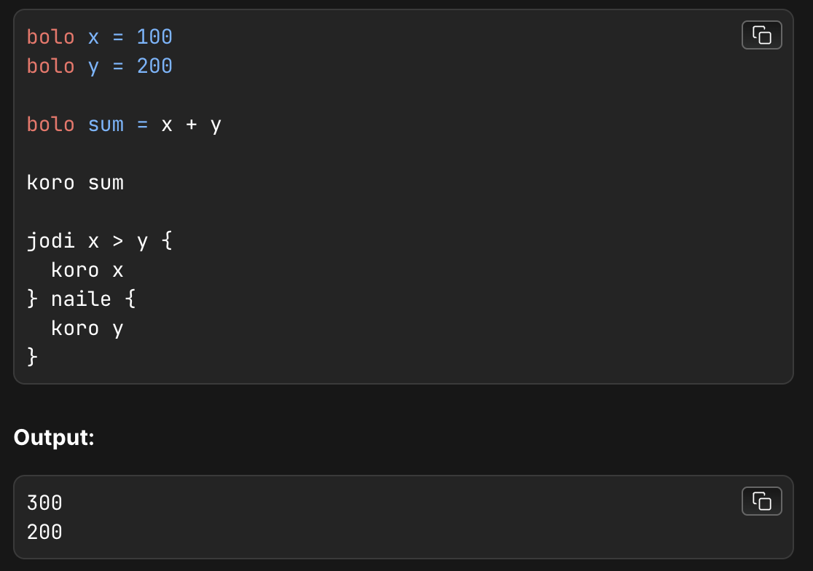

# Kotha

Kotha is a unique programming language built using Bengali syntax, designed to bring the beauty of coding to Bengali-speaking developers. Inspired by simplicity and accessibility, Kotha uses familiar Bengali terms for essential programming functions, making it easier to understand and use for beginners and experts alike.

<p align="center">
  
</p>

## Syntax Understanding
<div align="center">

| Syntax                      | Meaning                                   |
|------------------------------|-----------------------------------------------|
| **bolo** | Similar to const, var, let in javascript. It stores value.|
| **Koro**                    | Similar to printf in C. It returns the value.|
| **jodi and naile**               | Similar to the if else condition in any language.|
  
</div>

## Technologies
- Raw Javascript

## Installation
### Prerequisites
- Node.js
- npm or yarn

### Steps

1. Clone the repository
    ```bash
    https://github.com/Siratul804/Kotha.git
    ```
2. Navigate to the code.kotha & write your code then type 
    ```bash
    node compiler.js
    ```

## How do you build a programming language?

### To create a programming language, you’ll need three main components:

- Lexer
- Parser
- Compiler
 
### Here are some articles : 
- https://hackernoon.com/building-your-own-programming-language-from-scratch
- https://www.freecodecamp.org/news/the-programming-language-pipeline-91d3f449c919/
- https://fleker.medium.com/phillyscript-writing-my-own-programming-language-15bd6c23bcb2

## Code of main components
### Lexer

```bash
  function lexer(input) {
  const tokens = [];
  let cursor = 0;

  while (cursor < input.length) {
    let char = input[cursor];

    if (/\s/.test(char)) {
      cursor++;
      continue;
    }

    if (/[a-zA-Z]/.test(char)) {
      let word = "";
      while (/[a-zA-Z0-9]/.test(char)) {
        word += char;
        char = input[++cursor];
      }
      if (["bolo", "koro", "jodi", "naile"].includes(word)) {
        tokens.push({ type: "keyword", value: word });
      } else {
        tokens.push({ type: "identifier", value: word });
      }
      continue;
    }

    if (/[0-9]/.test(char)) {
      let num = "";
      while (/[0-9]/.test(char)) {
        num += char;
        char = input[++cursor];
      }
      tokens.push({ type: "number", value: parseInt(num) });
      continue;
    }

    if (/[\+\-\*\/=<>]/.test(char)) {
      tokens.push({ type: "operator", value: char });
      cursor++;
      continue;
    }

    if (/[{}]/.test(char)) {
      tokens.push({ type: "brace", value: char });
      cursor++;
      continue;
    }
  }

  return tokens;
}
```
    
## Parser

```bash
 function parser(tokens) {
  const ast = {
    type: "Program",
    body: [],
  };

  while (tokens.length > 0) {
    let token = tokens.shift();

    if (token.type === "keyword" && token.value === "bolo") {
      let declaration = {
        type: "Declaration",
        name: tokens.shift().value,
        value: null,
      };
      if (tokens[0].type === "operator" && tokens[0].value === "=") {
        tokens.shift();
        let expression = [];
        while (
          tokens.length > 0 &&
          tokens[0].type !== "keyword" &&
          tokens[0].type !== "brace"
        ) {
          expression.push(tokens.shift());
        }
        declaration.value = expression;
      }
      ast.body.push(declaration);
    }

    if (token.type === "keyword" && token.value === "koro") {
      ast.body.push({
        type: "Print",
        expression: tokens.shift().value,
      });
    }

    // Handle 'jodi' (if) and 'naile' (else)
    if (token.type === "keyword" && token.value === "jodi") {
      let condition = [];
      while (tokens.length > 0 && tokens[0].type !== "brace") {
        condition.push(tokens.shift());
      }

      tokens.shift(); // Skip the '{'
      let body = [];
      while (tokens.length > 0 && tokens[0].value !== "}") {
        body.push(tokens.shift());
      }
      tokens.shift(); // Skip the '}'

      let ifStatement = {
        type: "IfStatement",
        condition,
        body: parser(body), // Parse the block recursively
        elseBody: null,
      };

      if (tokens.length > 0 && tokens[0].value === "naile") {
        tokens.shift(); // Skip 'naile'
        tokens.shift(); // Skip the '{'
        let elseBody = [];
        while (tokens.length > 0 && tokens[0].value !== "}") {
          elseBody.push(tokens.shift());
        }
        tokens.shift(); // Skip the '}'
        ifStatement.elseBody = parser(elseBody); // Parse else block recursively
      }

      ast.body.push(ifStatement);
    }
  }

  return ast;
}
```


    
## Compiler 

```bash

function codeGen(node) {
  switch (node.type) {
    case "Program":
      return node.body.map(codeGen).join("\n");

    case "Declaration":
      return `const ${node.name} = ${codeGenExpression(node.value)};`;

    case "Print":
      return `console.log(${node.expression});`;

    case "IfStatement":
      const condition = codeGenExpression(node.condition);
      const ifBody = node.body.body.map(codeGen).join("\n");
      const elseBody = node.elseBody
        ? `else {\n${node.elseBody.body.map(codeGen).join("\n")}\n}`
        : "";
      return `if (${condition}) {\n${ifBody}\n} ${elseBody}`;
  }
}

function compiler(input) {
  const tokens = lexer(input);
  const ast = parser(tokens);
  const executableCode = codeGen(ast);
  return executableCode;
}

```


<p align="center">
<b>Made with ❤️ by   <a href="https://github.com/Siratul804">  Siratul Islam </a> </b> 
</p>

<p align="center">
  <a href="https://github.com/Siratul804?tab=repositories">View Project</a> •
  <a href="https://github.com/Siratul804">GitHub Profile</a> •
  <a href="https://www.linkedin.com/in/siratulislam/">LinkedIn</a> •
  <a href="https://x.com/Siratul074">Twitter</a>
</p>

<p align="center">
  <small>© 2024 Siratul Islam. All rights reserved.</small>
</p>
